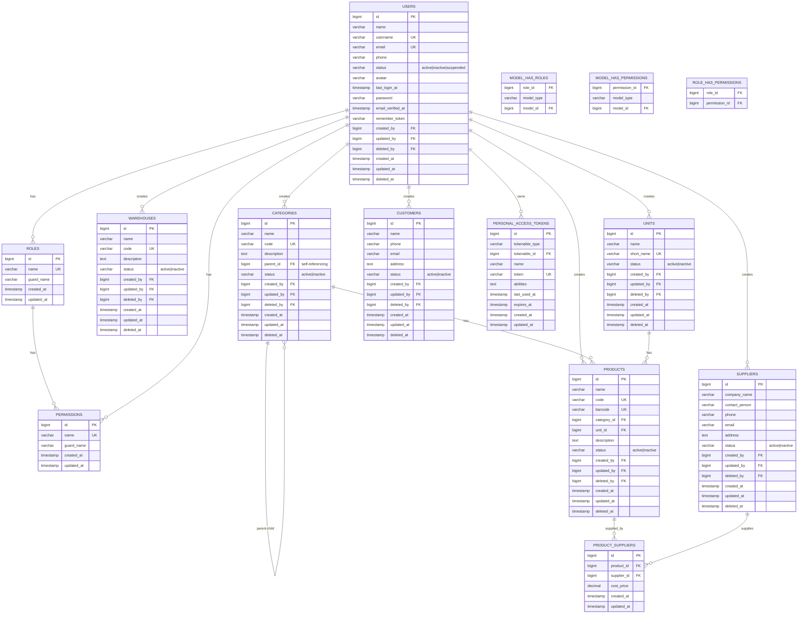

# Database Architecture — ER Diagram & Documentation

## Entity Relationship Diagram (Mermaid)



## Tables Overview

### Core System Tables

| Table | Purpose | Records (Seeded) |
|-------|---------|-------------------|
| `users` | System users | 3 |
| `roles` | Role definitions (Spatie) | 3 |
| `permissions` | Permission definitions (Spatie) | 17 |
| `model_has_roles` | User-Role pivot | 3 |
| `model_has_permissions` | User-Permission pivot | 17+ |
| `role_has_permissions` | Role-Permission pivot | 17+ |
| `personal_access_tokens` | Sanctum tokens | 0 |
| `sessions` | User sessions | varies |
| `cache` | Application cache | varies |
| `jobs` | Queue jobs | 0 |

### Business Tables

| Table | Purpose | Records (Seeded) |
|-------|---------|-------------------|
| `warehouses` | Storage locations | 2 |
| `categories` | Product categories (hierarchical) | 7 |
| `units` | Measurement units | 12 |
| `products` | Product catalog | 0 |
| `suppliers` | Supplier information | 0 |
| `customers` | Customer information | 0 |
| `product_suppliers` | Product-Supplier pivot (M2M) | 0 |

---

## Table Schemas

### `users` (Extended)

| Column | Type | Nullable | Default | Notes |
|--------|------|----------|---------|-------|
| `id` | bigint | NO | auto | PK |
| `name` | varchar(255) | NO | - | Full name |
| `username` | varchar(255) | NO | - | Unique |
| `email` | varchar(255) | NO | - | Unique, login |
| `phone` | varchar(255) | YES | NULL | |
| `status` | enum | NO | 'active' | active/inactive/suspended |
| `avatar` | varchar(255) | YES | NULL | File path |
| `password` | varchar(255) | NO | - | Hashed |
| `last_login_at` | timestamp | YES | NULL | |
| `email_verified_at` | timestamp | YES | NULL | |
| `remember_token` | varchar(100) | YES | NULL | |
| `created_by` | bigint | YES | NULL | FK → users.id |
| `updated_by` | bigint | YES | NULL | FK → users.id |
| `deleted_by` | bigint | YES | NULL | FK → users.id |
| `created_at` | timestamp | NO | now | |
| `updated_at` | timestamp | NO | now | |
| `deleted_at` | timestamp | YES | NULL | Soft delete |

### `warehouses`

| Column | Type | Nullable | Default | Notes |
|--------|------|----------|---------|-------|
| `id` | bigint | NO | auto | PK |
| `name` | varchar(255) | NO | - | |
| `code` | varchar(255) | NO | - | Unique |
| `description` | text | YES | NULL | |
| `status` | enum | NO | 'active' | active/inactive |
| `created_by` | bigint | YES | NULL | FK → users.id |
| `updated_by` | bigint | YES | NULL | FK → users.id |
| `deleted_by` | bigint | YES | NULL | FK → users.id |
| `created_at` | timestamp | NO | now | |
| `updated_at` | timestamp | NO | now | |
| `deleted_at` | timestamp | YES | NULL | Soft delete |

**Indexes:** name, status
**Unique:** code

### `categories`

| Column | Type | Nullable | Default | Notes |
|--------|------|----------|---------|-------|
| `id` | bigint | NO | auto | PK |
| `name` | varchar(255) | NO | - | |
| `code` | varchar(255) | NO | - | Unique |
| `description` | text | YES | NULL | |
| `parent_id` | bigint | YES | NULL | FK → categories.id (self-ref) |
| `status` | enum | NO | 'active' | active/inactive |
| `created_by` | bigint | YES | NULL | FK → users.id |
| `updated_by` | bigint | YES | NULL | FK → users.id |
| `deleted_by` | bigint | YES | NULL | FK → users.id |
| `created_at` | timestamp | NO | now | |
| `updated_at` | timestamp | NO | now | |
| `deleted_at` | timestamp | YES | NULL | Soft delete |

**Indexes:** name, status
**Unique:** code
**Self-referencing:** parent_id → categories.id

### `units`

| Column | Type | Nullable | Default | Notes |
|--------|------|----------|---------|-------|
| `id` | bigint | NO | auto | PK |
| `name` | varchar(255) | NO | - | e.g., "Kilogram" |
| `short_name` | varchar(255) | NO | - | Unique, e.g., "kg" |
| `status` | enum | NO | 'active' | active/inactive |
| `created_by` | bigint | YES | NULL | FK → users.id |
| `updated_by` | bigint | YES | NULL | FK → users.id |
| `deleted_by` | bigint | YES | NULL | FK → users.id |
| `created_at` | timestamp | NO | now | |
| `updated_at` | timestamp | NO | now | |
| `deleted_at` | timestamp | YES | NULL | Soft delete |

**Indexes:** name, status
**Unique:** short_name

### `products`

| Column | Type | Nullable | Default | Notes |
|--------|------|----------|---------|-------|
| `id` | bigint | NO | auto | PK |
| `name` | varchar(255) | NO | - | |
| `code` | varchar(255) | NO | - | Unique |
| `barcode` | varchar(255) | YES | NULL | Unique |
| `category_id` | bigint | NO | - | FK → categories.id |
| `unit_id` | bigint | NO | - | FK → units.id |
| `description` | text | YES | NULL | |
| `status` | enum | NO | 'active' | active/inactive |
| `created_by` | bigint | YES | NULL | FK → users.id |
| `updated_by` | bigint | YES | NULL | FK → users.id |
| `deleted_by` | bigint | YES | NULL | FK → users.id |
| `created_at` | timestamp | NO | now | |
| `updated_at` | timestamp | NO | now | |
| `deleted_at` | timestamp | YES | NULL | Soft delete |

**Indexes:** name, status, category_id, unit_id
**Unique:** code, barcode

### `suppliers`

| Column | Type | Nullable | Default | Notes |
|--------|------|----------|---------|-------|
| `id` | bigint | NO | auto | PK |
| `company_name` | varchar(255) | NO | - | |
| `contact_person` | varchar(255) | YES | NULL | |
| `phone` | varchar(255) | YES | NULL | |
| `email` | varchar(255) | YES | NULL | |
| `address` | text | YES | NULL | |
| `status` | enum | NO | 'active' | active/inactive |
| `created_by` | bigint | YES | NULL | FK → users.id |
| `updated_by` | bigint | YES | NULL | FK → users.id |
| `deleted_by` | bigint | YES | NULL | FK → users.id |
| `created_at` | timestamp | NO | now | |
| `updated_at` | timestamp | NO | now | |
| `deleted_at` | timestamp | YES | NULL | Soft delete |

**Indexes:** company_name, status

### `customers`

| Column | Type | Nullable | Default | Notes |
|--------|------|----------|---------|-------|
| `id` | bigint | NO | auto | PK |
| `name` | varchar(255) | NO | - | |
| `phone` | varchar(255) | YES | NULL | |
| `email` | varchar(255) | YES | NULL | |
| `address` | text | YES | NULL | |
| `status` | enum | NO | 'active' | active/inactive |
| `created_by` | bigint | YES | NULL | FK → users.id |
| `updated_by` | bigint | YES | NULL | FK → users.id |
| `deleted_by` | bigint | YES | NULL | FK → users.id |
| `created_at` | timestamp | NO | now | |
| `updated_at` | timestamp | NO | now | |
| `deleted_at` | timestamp | YES | NULL | Soft delete |

**Indexes:** name, status

### `product_suppliers` (Pivot)

| Column | Type | Nullable | Default | Notes |
|--------|------|----------|---------|-------|
| `id` | bigint | NO | auto | PK |
| `product_id` | bigint | NO | - | FK → products.id |
| `supplier_id` | bigint | NO | - | FK → suppliers.id |
| `cost_price` | decimal(12,2) | YES | NULL | |
| `created_at` | timestamp | NO | now | |
| `updated_at` | timestamp | NO | now | |

**Unique:** (product_id, supplier_id)

---

## Relationships Summary

```
User ──────────── creates ──────── Warehouse (1:N)
User ──────────── creates ──────── Category (1:N)
User ──────────── creates ──────── Unit (1:N)
User ──────────── creates ──────── Product (1:N)
User ──────────── creates ──────── Supplier (1:N)
User ──────────── creates ──────── Customer (1:N)

Category ──────── parent ──────── Category (N:1 self-ref)
Category ──────── children ────── Category (1:N self-ref)
Category ──────── has ─────────── Products (1:N)

Unit ──────────── has ─────────── Products (1:N)

Product ────────── belongs to ──── Category (N:1)
Product ────────── belongs to ──── Unit (N:1)
Product ────────── supplied by ── Supplier (M:N via pivot)

Supplier ───────── supplies ───── Product (M:N via pivot)

User ──────────── has ──────────── Roles (M:N via Spatie)
Role ──────────── has ──────────── Permissions (M:N via Spatie)
User ──────────── has ──────────── Permissions (M:N via Spatie)
```

---

## Module Dependencies

```
┌─────────────────────────────────────────────────────────────┐
│                      AUTHENTICATION                         │
│  users ←── roles ←── permissions (Spatie Permission)       │
│              │                                              │
│              └── personal_access_tokens (Sanctum)           │
└─────────────────────┬───────────────────────────────────────┘
                      │
┌─────────────────────▼───────────────────────────────────────┐
│                    PRODUCT CATALOG                          │
│  categories (hierarchical)                                  │
│  units (measurement types)                                  │
│  products ←── category_id, unit_id                          │
│  suppliers                                                  │
│  product_suppliers (pivot with cost_price)                  │
└─────────────────────┬───────────────────────────────────────┘
                      │
┌─────────────────────▼───────────────────────────────────────┐
│                    WAREHOUSE MANAGEMENT                     │
│  warehouses                                                 │
│  (products will reference warehouses in future phases)      │
└─────────────────────┬───────────────────────────────────────┘
                      │
┌─────────────────────▼───────────────────────────────────────┐
│                    INVENTORY MANAGEMENT                     │
│  (stock tracking, transactions — future phases)             │
└─────────────────────┬───────────────────────────────────────┘
                      │
┌─────────────────────▼───────────────────────────────────────┐
│                    CUSTOMER MANAGEMENT                      │
│  customers                                                  │
└─────────────────────────────────────────────────────────────┘
```

---

## Seed Data Summary

### Roles & Permissions

| Role | Permissions |
|------|------------|
| **admin** | All 17 permissions (full access) |
| **warehouse** | manage-warehouses, manage-products, manage-categories, manage-units, manage-suppliers, manage-customers, view-warehouse-dashboard, access-warehouse-panel |
| **inventory** | manage-inventory, manage-products, manage-categories, manage-units, view-reports, view-inventory-dashboard, access-inventory-panel |

### Users

| Name | Email | Password | Role |
|------|-------|----------|------|
| Admin | admin@inventory.com | password | admin |
| Warehouse User | warehouse@inventory.com | password | warehouse |
| Inventory User | inventory@inventory.com | password | inventory |

### Units (12)

| Name | Short Name |
|------|------------|
| Piece | pc |
| Box | box |
| Kilogram | kg |
| Gram | g |
| Liter | L |
| Milliliter | mL |
| Meter | m |
| Centimeter | cm |
| Pair | pr |
| Set | set |
| Pack | pkg |
| Dozen | dz |

### Categories (7)

| Name | Code | Parent |
|------|------|--------|
| Electronics | ELEC | — |
| Phones | ELEC-PH | Electronics |
| Laptops | ELEC-LP | Electronics |
| Office Supplies | OFF | — |
| Paper & Stationery | OFF-PAPER | Office Supplies |
| Food & Beverages | FOOD | — |
| Drinks | FOOD-DRK | Food & Beverages |

### Warehouses (2)

| Name | Code | Description |
|------|------|-------------|
| Main Warehouse | WH-001 | Primary storage facility |
| Secondary Warehouse | WH-002 | Overflow and backup storage |
